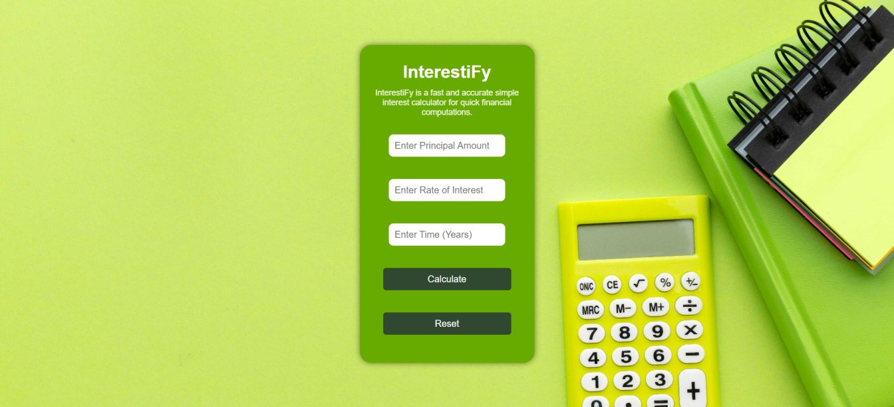

# InterestiFy

InterestiFy is a user-friendly web application that computes the Simple Interest (SI), Principal Amount and Total Value based on the values entered by the user. The app offers a sleek, minimalistic design, performs instant calculations and is fully responsive, ensuring a seamless experience across different devices.

## 🎨 Demo Screenshot



## 🔗 Live Demo

Check out the app live here: **[InterestiFy](https://premkrrajbhar.github.io/InterestiFy/)**

## 📋 Features

- **Real-Time Calculation**: Calculates the Simple Interest, Principal Amount, and Total Value as soon as the "Calculate" button is clicked.
- **Input Validation**: Ensures that all fields are filled before calculating. Display a popup to the user if any input is missing and It also check that all inputs should be a positive numbers.
- **Reset Functionality**: Clears all input fields and hides the results for a fresh start.
- **Responsive Design**: Optimized for desktops, tablets, and mobile devices to ensure a seamless user experience.
- **User-Friendly Interface**: Easy-to-use interface with clear input fields, action buttons, and well-displayed results.

## 🛠️ Technologies Used

- **HTML**: Provides the basic structure of the app.
- **CSS**: Styles the app and ensures a clean, modern layout with a responsive design.
- **JavaScript**: Handles the logic for calculating Simple Interest and dynamically updating the results on the page.

## 💻 How to Use

1. **Enter Values**: Input the **Principal Amount**, **Rate of Interest**, and **Time (in years)** in the respective fields.
2. **Calculate Simple Interest**: Click the **"Calculate"** button to see the calculated **Interest Earned**, **Principal Amount**, and **Total Value**.
3. **Reset Fields**: Click the **"Reset"** button to clear all input fields and hide the displayed results.

## 📂 Project Structure

```
├── README.md
├── assets/
│   ├── favicon/
│   │   └── InterestiFy-favicon.png
│   └── screenshot/
│       └── screenshot.jpg
├── css/
│   └── style.css
├── image/
│   └── bg-image.jpg
├── index.html
└── script/
    └── script.js

```

## 📥 How to Run Locally

- Step 1: Clone the repository:

```bash
   git clone https://github.com/premkrrajbhar/InterestiFy.git
```

- Step 2: Navigate to the project folder:

```bash
   cd InterestiFy
```

- Step 3: Open the `index.html` file in your web browser to start using the app.

## 🤝 Contributing

Contributions are welcome! Feel free to submit a pull request or open an issue for any suggestions or improvements.

## 📞 Contact

For any questions or feedback, please reach out to:

- **Email**: [premkumar224487@gmail.com](mailto:premkumar224487@gmail.com)
- **GitHub**: [premkrrajbhar](https://github.com/premkrrajbhar)
